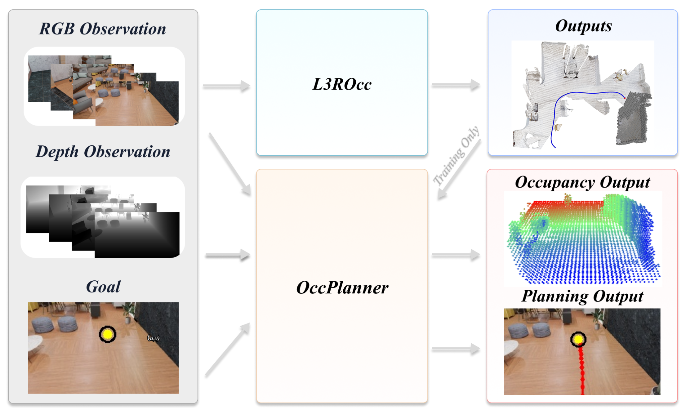

# OccPlanner

Project page for **OccPlanner: Goal-Aware Occupancy-Conditioned Diffusion Planner** and **L3ROcc: Local 3D Reconstruction with Occupancy**.

OccPlanner grounds a pixel goal in robot-centric metric space, predicts visibility-aware local 3D occupancy from RGB-D history, and generates continuous obstacle-aware trajectories with a diffusion planner. L3ROcc supplies dense training supervision by converting monocular navigation videos into temporally consistent occupancy, visibility, and trajectory annotations.

[Project Page](https://sceirobotics.github.io/OccPlanner/) · **Paper:** Coming soon · **Code:** Coming soon

## Method

- **OccPlanner** is a goal-aware occupancy-conditioned diffusion planner for pixel-goal navigation. It grounds the pixel goal in robot-centric metric space, predicts visibility-aware local 3D occupancy from RGB-D history, and uses temporal context together with compact near-ground occupancy tokens to condition continuous trajectory generation.
- **L3ROcc** is a training-data generation pipeline that converts monocular navigation videos into temporally consistent, robot-centric occupancy, visibility, and trajectory annotations through geometric reconstruction, metric alignment, voxelization, and visibility-aware ray marching.

## Evaluation

OccPlanner is evaluated in closed loop on 6,000 fixed episodes across 60 unseen indoor scenes, covering home, commercial, cluttered-easy, and cluttered-hard environments at 3–5 m and 5–8 m goal ranges.

For 5–8 m goals, OccPlanner improves success rate over NavDP from **19.43% to 86.20%** in cluttered-easy scenes and from **19.77% to 84.92%** in cluttered-hard scenes, while also improving SPL and reducing final distance to goal.

## Real-world experiments

We compare the simulator-trained and real-world fine-tuned models in an open-loop setting using identical RGB-D observations and pixel goals. The fine-tuned OccPlanner is also deployed on a **Unitree Go2** for qualitative physical closed-loop navigation in a cluttered office. These runs are demonstrations rather than a quantitative real-world benchmark.
